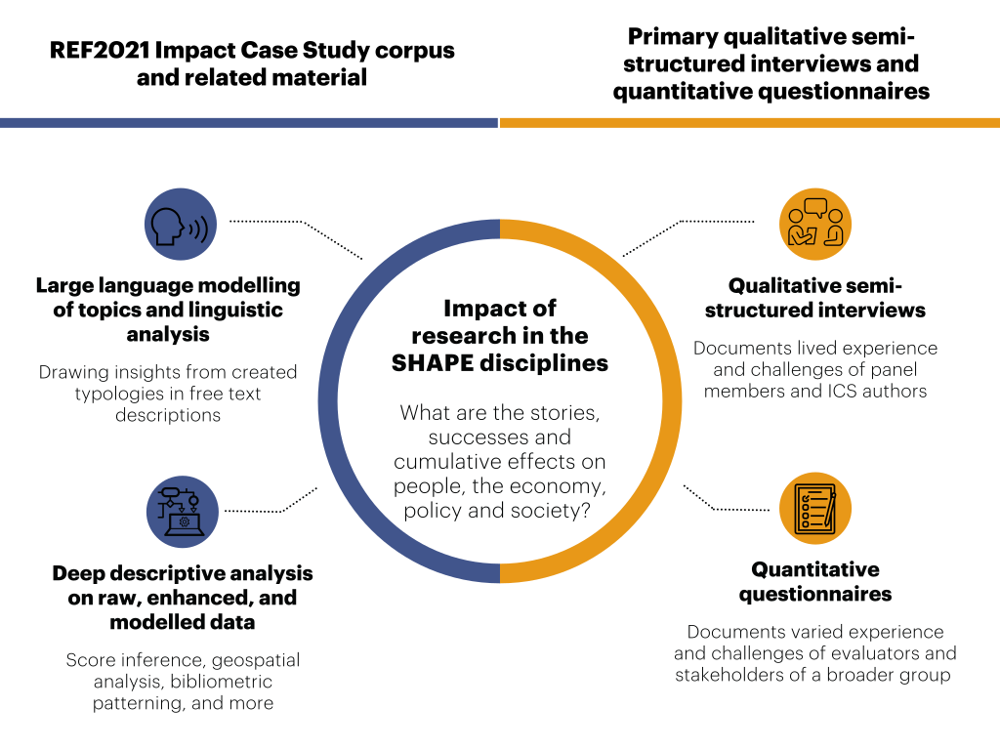

# The SHAPE of Impact

A repository to analyse the Impact Case Studies submitted to the Research Excellence Framework, 2021. A link to the final, published version of the report is available [here](https://www.thebritishacademy.ac.uk/publications/the-shape-of-research-impact/).

**Investigators:** Sander Wagner (Co-I), Charles Rahal (Co-I), Douglas Leasure (Co-I), Mark Verhagen (Co-I), Bo Zhao (Co-I) and Melinda C. Mills (PI).

**Researchers/Research Assistants:** Simon Cooper, Ekaterina Degtiareva, Giordano Epifani, Yifan Liu, Brenda Mccollum, Alice Spiers and Reja Wyss.

**Web Development:** [GISRede](https://www.gisrede.com/) (Maksym Bondarenko, David Kerr) 

**Research Support:** Hamza Shams, Bradley Smith, Michelle Thorpe.

**Funders:** British Academy and Academy of Social Sciences.

**Please cite this work as:** Wagner, S., Rahal, C., Spiers, A., Leasure, D., Verhagen, M., Zhao, B., Li, L., Lu, Y., REF 2021 LCDS Project Team, and Mills, M. C. (2024), 'The SHAPE of Research Impact', British Academy and the Academy of Social Sciences, ISBN 978-0-85672-686-6.

### Data

The main source of raw data which powers this analysis is the REF 2021 Database. The five key files relate to:
1. The raw REF ICS dataset itself.
2. The 'tags' associated with the raw ICS.
3. The 'environmental' data associated with submitting departments.
4. The 'outputs' dataset, which contains information on submitted academic outputs.
5. The 'results' dataset, which details results across impact, environment, and output.

The REF 2021 data is generally available from [https://results2021.ref.ac.uk/](https://results2021.ref.ac.uk/). All REF submissions information, including downloadable submissions data, REF impact case studies, institution environment statements and unit environment statements can be used under the CC BY 4.0 licence. Use is permitted under [these licence conditions](http://creativecommons.org/licenses/by/4.0/legalcode). Shapefiles for the static analysis are provided by Natural Earth: Free vector and raster map data @ [naturalearthdata.com](naturalearthdata.com).

For specific parts of the analysis (gender, interdisciplinarity, funding, citations and altmetrics), we use data obtained from [Dimensions](https://dimensions.ai/), and re-share parts of it with explicit agreement from [Digital Science](https://www.digital-science.com/). Our shareable data also contains scientometric data from [OpenAlex](https://openalex.org/).

For a certain number of our analyses, manual curation is necessary. Our manually curated files can be found at `./data/manual`, and include information on:

* Funders who power the Impact Case Studies
* Countries where beneficiaries of the research are located.
* GRID lookup data.
* Identifiers of the underpinning research
* A manually curated list of stopwords.
* A lookup table which maps ICS documents to Topics and Grand Impact Areas.

The final, enhanced, and complete version of our dataset which is made available as part of this project can be found at `./data/final/`, i.e. [here](https://github.com/OxfordDemSci/ICS_Analysis/blob/main/data/final/enhanced_ref_data.zip). This is created by the script at `./src/generate_data/make_enhanced_data.py` [here](https://github.com/OxfordDemSci/ICS_Analysis/tree/main/src/generate_dataset). This script is also responsible for creating the final dataset which is used to power the dashboard, which can be found at `./src/dashboard/data/`.

### Analysis

The majority of the analysis is split into three distinct types/parts.

1. The first is the BERTopic based large language model. The code which creates this can be found in `./src/topic_modelling.` Thanks to the hard work of [bs-dev](https://github.com/bz-dev) and [lindali97](https://github.com/lindali97) here!

2. General descriptive analysis code found in `./src/analysis`, which is split into one parts:

* The static analysis, which is found in `./src/analysis/static`, and:
      a. 'Grand Impact Area' by Grand Impact Area outputs (Figures 3-12), and:
* Figures 13-18 which provide broad level analysis of:
    * i. The Environment of Impact
    * ii. The Geography of Impact
    * iii. The Funding of Impact
    * iv. The Inter- and Multidisciplinary Nature of Impact	83
    * v. The Gendered Nature of Underpinning Research

* The interactive dashboard. This is found in `./src/dashboard`, and is a standalone repository which is linked to this one as a submodule.

### Dashboard

An online interactive dashboard accompanies this work, found at [https://shape-impact.co.uk](https://shape-impact.co.uk). This dashboard is entirely reproducible, with code which creates it available at `./src/dashboard. We are especially grateful for the help of [GISRede](https://www.gisrede.com/) for their role in it's development.

### Contact

For any general queries related to this work, please contact `lcds.office@demography.ox.ac.uk` or for media related enquiries, please contact `lcds.office@demography.ox.ac.uk`. For technical issues related to the programmatic analysis of this work, please raise an Issue, or feel free to open a Pull Request.

### License

    SHAPE of Research Impact Dashboard
    Copyright (C) 2023 University of Oxford
    
    This program is free software: you can redistribute it and/or modify
    it under the terms of the GNU General Public License as published by
    the Free Software Foundation, either version 3 of the License, or
    any later version.
    
    This program is distributed in the hope that it will be useful,
    but WITHOUT ANY WARRANTY; without even the implied warranty of
    MERCHANTABILITY or FITNESS FOR A PARTICULAR PURPOSE.  See the
    GNU General Public License for more details.

This license protects everyone's freedom to:  
- use the software for any purpose,
- change the software to suit any needs,
- share the software with friends and neighbors, and
- share any changes made to the software.

For further information, you can access a full-text copy of the GNU General Public License from the `LICENSE` file in this repository 
or by visiting <a href="https://www.gnu.org/licenses/gpl-3.0.html" target="_blank">https://www.gnu.org/licenses/gpl-3.0.html </a>.  

